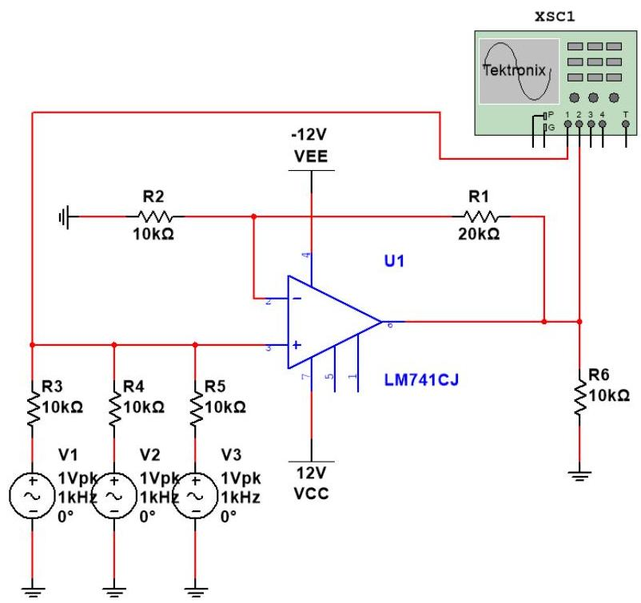
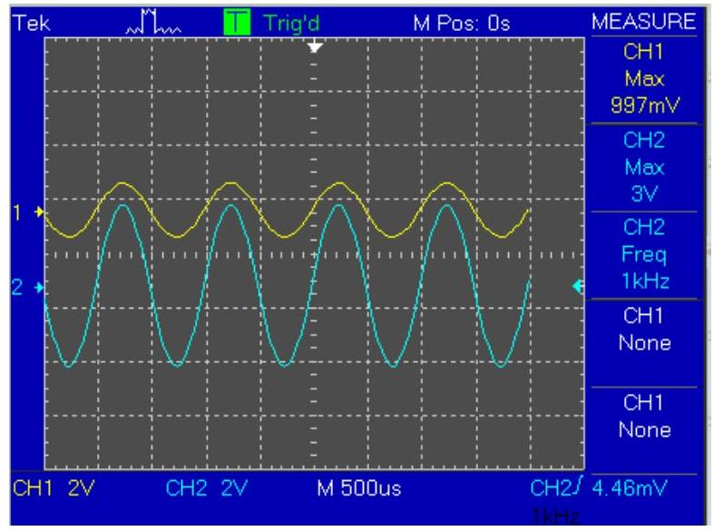
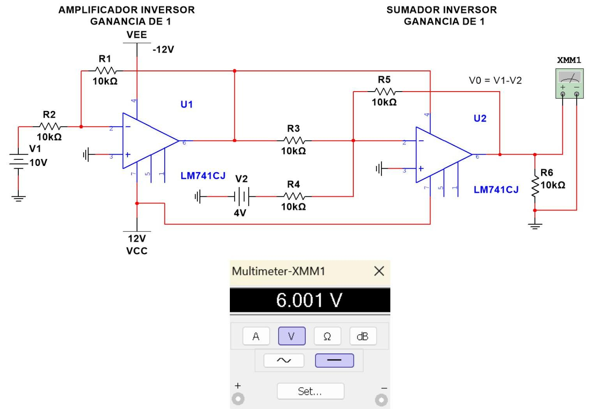
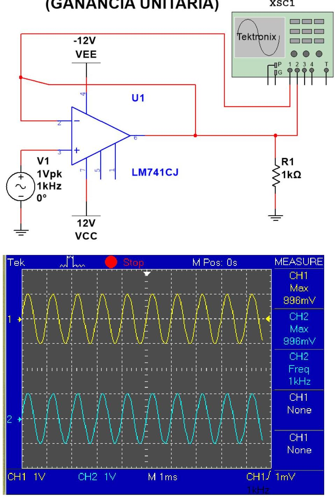

# Tarea 2.3 

## 1. Simulaciones

- Circuito sumador No inversor.

### 3.4 AMPLIFICADOR SUMADOR NO INVERSOR

Mismo voltaje de entrada y misma frecuencia

---

- Amplificador de diferencia (restador).

---

- Seguidor de voltaje. (Ganancia unitaria).

SEGUIDOR DE VOLTAJE (GANANCIA UNITARIA)

---

# 2. Investigación de aplicaciones de los circuitos simulados 

El circuito sumador no inversor se utiliza cuando es necesario combinar varias señales de voltaje y mantenerlas en fase a la salida. Su principal ventaja es que no invierte las señales y, gracias a la alta impedancia de entrada que ofrece el amplificador operacional, no afecta a las fuentes que lo alimentan. Este tipo de circuito es útil en aplicaciones de procesamiento de audio, mezcladores de señales y sistemas de adquisición de datos, donde se requiere sumar diferentes entradas sin alterar su polaridad.

Por otro lado, el amplificador de diferencia (restador) tiene como aplicación principal obtener la diferencia entre dos señales, eliminando componentes comunes en ambas. Esto lo hace fundamental en el acondicionamiento de señales, por ejemplo, en sistemas de instrumentación y medición, donde es necesario aislar una señal útil del ruido que pueda estar presente en las dos entradas. También se emplea en aplicaciones de control y comunicación, ya que permite comparar niveles de voltaje y generar una salida proporcional a su diferencia.

Finalmente, el seguidor de voltaje de ganancia unitaria se aplica principalmente como un búfer o etapa de aislamiento entre circuitos. Gracias a su alta impedancia de entrada y baja impedancia de salida, evita que una fuente de señal se vea afectada por la carga conectada, garantizando que el voltaje se transfiera sin pérdidas. Es ampliamente usado en sistemas de audio, sensores, y en cualquier situación donde se requiera mantener la integridad de una señal al interconectar distintas etapas electrónicas.

---

# 3. Conclusiones 

El estudio de los circuitos sumador no inversor, amplificador de diferencia y seguidor de voltaje demuestra la versatilidad de los amplificadores operacionales en aplicaciones prácticas de la electrónica.
Cada configuración cumple una función específica, el sumador no inversor permite combinar señales sin alterar su fase, el amplificador de diferencia facilita la eliminación de componentes comunes y la comparación de señales, mientras que el seguidor de voltaje asegura la transferencia de señales sin pérdidas al actuar como búfer de impedancias.

En conjunto, estos circuitos se aplican en áreas como instrumentación, audio, sistemas de control y adquisición de datos, consolidando a los amplificadores operacionales como herramientas esenciales en el diseño electrónico.

## 4. Bibliografía y Referencias

[1] EndNote. (2016). Thomson Reuters. [Online]. Available: Sedra, A. S., \& Smith, K. C. (2016). Microelectronic Circuits. Oxford University Press.
[2] Boylestad, R. L., \& Nashelsky, L. (2013). Electrónica: Teoría de Circuitos y Dispositivos Electrónicos. Pearson.
[3] Malvino, A., \& Bates, D. (2015). Principios de Electrónica. McGraw-Hill.
[4] Franco, S. (2015). Design with Operational Amplifiers and Analog Integrated Circuits. McGraw-Hill.